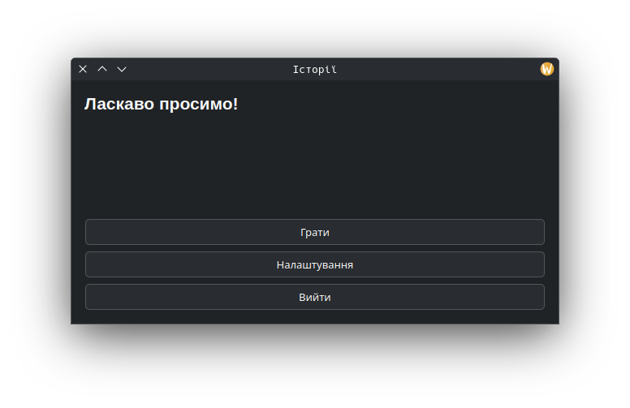
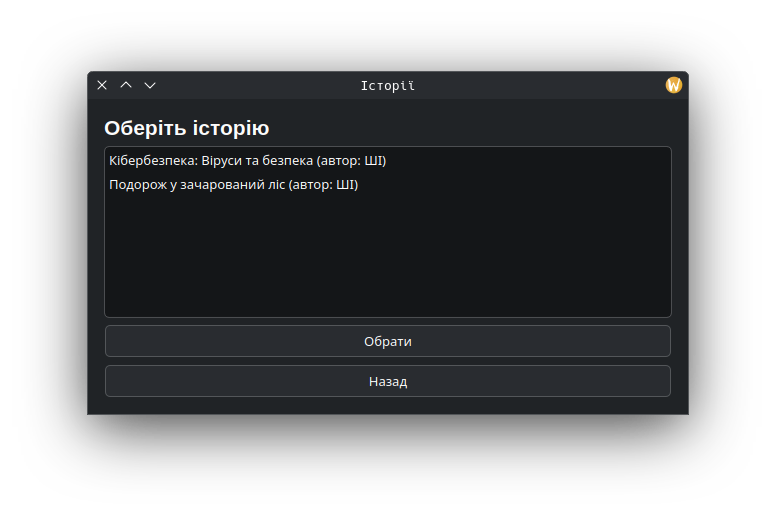
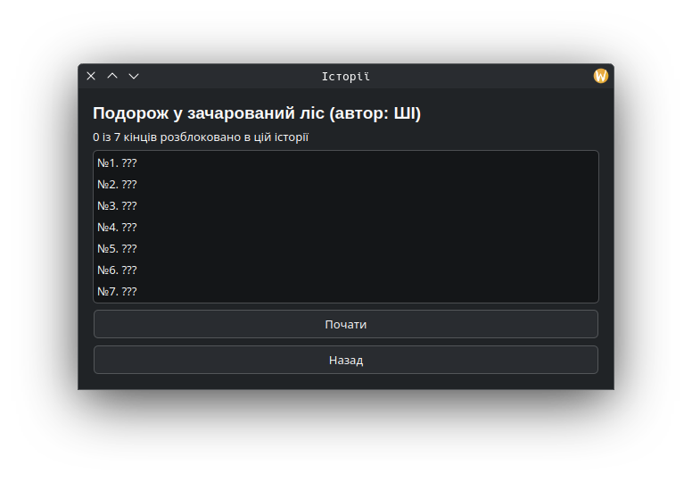
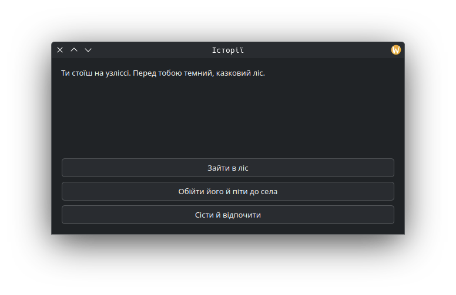
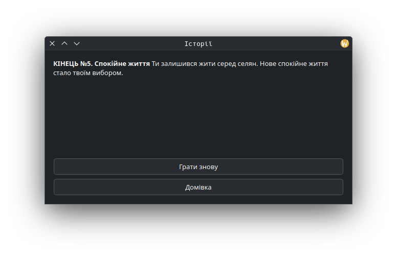

# stories
Simple app on PyQt5 to play a stories. Only Ukrainian lang is supported now. You can create your own stories with YAML files in "stories" folders. Most part of code and all stories generated with ChatGPT-5.

